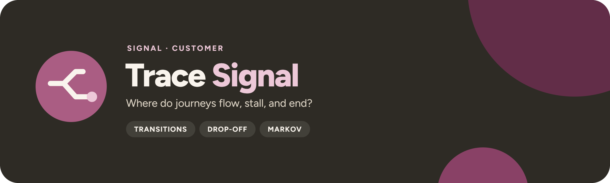

<p align="center">
  
</p>

<p align="center">
  <a href="https://github.com/UlrikErlingsen/journey-path-analysis/actions"></a>
  <a href="https://github.com/UlrikErlingsen/signal-hub"></a>
  
  
  <a href="LICENSE"></a>
</p>

<p align="center"><strong>Open event-log evidence — order the events, compare observed paths, stress-test the model.</strong></p>

**Trace Signal** is a local-first workbench for real event-log sequence analysis. It combines a strict event-ordering contract, empirical transitions with uncertainty, relative positional roles, terminal drop-off and depth, supported path comparison, and a transparent first-order Markov sensitivity check. It asks:

> Which transitions and complete paths occur in observed journeys, where do they end, how do touchpoint roles vary with relative sequence position, and how sensitive is a fitted first-order Markov description to deleting a touchpoint state?

It is **not a journey-diagram maker**. Every result is computed from case-level ordered events. Everything runs locally with open-source Python packages. There is no account, telemetry, external AI call, remote database, or built-in persistence.

## Read this first

> **The app describes logged sequences; it does not identify incremental channel value.** Touchpoint occurrence, order, and path membership are selected rather than randomized. Markov removal is model sensitivity—not the effect of switching off a real touchpoint. Test interventions through **[Experiment Signal](https://github.com/UlrikErlingsen/experiment-analysis)**.

Early, middle, and late mean thirds of each observed journey, not universal funnel stages. A non-converted journey is a supplied observation-window outcome, not proof of dissatisfaction. Missing, anonymous, offline, cross-device, or incorrectly stitched events remain invisible.

**Working-name status:** an informal exact-string screen on 17 July 2026 found no active company or product named “TraceSignal” (the nearest uses are a MATLAB report-generator API function, an IBM z/VM trace event, the generic electronics term “signal trace,” and reversed-order “SignalTrace” products in unrelated categories). The product is written “Trace Signal” since 1.1.0; the screen was not repeated for the spaced form. That is encouraging, but the name is not legally cleared and the screen is not legal advice or a trademark opinion. See [the name screen](docs/name-screen.md).

## Scope

**Version 1.1 supports:**

- empirical transitions from `START` through touchpoints to `CONVERSION` or `DROP_OFF`, with Wilson intervals and next-state entropy;
- relative early, middle, late, and single-touch roles, timing, and outcome association;
- terminal drop-off after a visited touchpoint and observed depth continuation;
- complete path support, conversion association, duration, value, subgroup differences, and outcome-conditioned transition differences;
- first-order absorbing Markov conversion probability and transparent state-deletion sensitivity;
- cluster-bootstrap intervals and a conditional mutual information diagnostic for first-order memory failure.

**It does not:** recover unlogged events, infer customer intent, author workshop journey maps, assign causal channel credit, estimate incrementality, optimize budgets, or predict the real effect of removing a touchpoint. The first-order chain is a deliberately inspectable approximation, not a claim that journeys truly have one-step memory. Where a sibling app covers it, use **[Experiment Signal](https://github.com/UlrikErlingsen/experiment-analysis)** for genuine intervention questions and **[Alloc Signal](https://github.com/UlrikErlingsen/marketing-mix-allocation)** for forward-looking budget scenarios.

## Try the demo in three minutes

1. Start the app; the deterministic **Fictional demonstration** is active by default.
2. Open **Data & sequence contract** to inspect journey boundaries, event order, outcomes, touchpoint coverage, and warnings.
3. Review **Transitions & roles** for empirical transition probabilities, next-state entropy, and relative early/middle/late occurrence.
4. Use **Drop-off & depth** to locate terminal nonconversion endings and observed depth attrition.
5. Compare supported complete paths, subgroups, and outcome-conditioned transitions in **Path comparison**.
6. Read the fitted conversion probability, clustered intervals, and first-order memory diagnostic in **Markov removal sensitivity**.
7. Export the XLSX workbook from **Evidence pack** and carry its caveats into the decision record.

The demonstration is deterministic synthetic data. Its customers, events, paths, values, subgroups, and outcomes represent no real person, organization, course case, or empirical finding.

## Data contract

Use one row per observed event. CSV and XLSX are supported (an XLSX workbook is read from its `events` sheet when present).

| journey_id | timestamp | event_order | touchpoint | converted | customer_id | subgroup | journey_value |
|---|---|---:|---|---:|---|---|---:|
| J001 | 2026-01-08 09:00:00Z | 1 | Paid social | 1 | C001 | New | 89.00 |
| J001 | 2026-01-08 09:12:00Z | 2 | Product page | 1 | C001 | New | 89.00 |

Required columns:

- `journey_id`: one declared journey boundary;
- `timestamp`: a parseable event time;
- `touchpoint`: the observed state label;
- `converted`: a stable binary journey outcome.

Optional columns are numeric `event_order` for timestamp ties, stable `customer_id` for clustered uncertainty, stable `subgroup`, and non-negative stable `journey_value`. The app requires at least 20 journeys, three touchpoints, and both outcomes. Tied timestamps require explicit order; reserved terminal-state labels and duplicate event keys are refused. Uploads are capped at 50 MB, 250,000 rows, and 200 columns as a local safety limit. The fictional event log and a starter template are in [`examples/`](examples/). See the [data guide](docs/data-guide.md).

## Analysis contract

Consecutive repeats can be retained or collapsed, and that choice is recorded. The sidebar **Sequence contract** declares, before any result is read:

- whether consecutive repeated touchpoints are collapsed;
- the minimum journeys a complete path needs before it enters the primary comparison;
- the minimum transitions per outcome cell before an outcome-conditioned difference is ranked;
- the number of removal-sensitivity bootstrap repetitions and the interval level.

The evidence pack records these exact settings next to every table, so another analyst can reproduce the run. The [starter template](examples/tracesignal-starter-template.csv) shows the expected columns.

## Methods

The workflow constructs an ordered sequence per journey, optionally collapses consecutive identical states, and appends the supplied terminal outcome. It then calculates empirical transition counts and row probabilities, positional roles from normalized within-journey location, terminal drop-off, depth survival, and supported complete-path summaries.

The Markov page fits a first-order absorbing chain to those observed transitions. For each touchpoint, it deletes the state, reconnects the remaining sequence through row renormalization, and reports the change in fitted conversion probability. Clustered resampling uses `customer_id` when supplied and otherwise treats journeys as independent. Negative sensitivities can occur. None of these quantities is a real intervention effect or causal attribution.

The conditional mutual information diagnostic asks whether the prior state still contains information about the next state after conditioning on the current state. It is a misspecification signal, not a pass/fail proof.

See [methods](docs/methods.md).

## Decision statuses

Trace Signal deliberately returns no verdict, winner, or channel-credit label. Its only flags are support flags that keep thin evidence out of the primary comparison:

- **Supported path** (`meets_minimum_support`): the complete path reaches the declared minimum number of journeys. Rare paths stay in the evidence pack.
- **Supported outcome-conditioned transition** (`meets_minimum_support`): the transition reaches the declared minimum count in both the converted and the drop-off group (default 10, floor 2), so sparse cells cannot top the ranking.

Escalate before acting when stitching changed between periods, timestamps tie without an ordering field, cohorts have unequal observation windows, a few customers contribute many journeys, path support is thin, channel availability decides who can enter a path, or the proposed decision is to remove, fund, or claim incrementality for a touchpoint.

See the [decision guide](docs/decision-guide.md).

## Exports

The XLSX evidence pack records:

- app version, source label, method boundaries, and name status;
- event-log overview, taxonomy, outcome and subgroup counts, and audit warnings;
- transition probabilities and uncertainty, entropy, positional roles, terminal drop-off, and depth;
- complete paths, subgroup summaries, and outcome-conditioned transition comparisons;
- fitted Markov summary, state-deletion sensitivity, bootstrap intervals, and memory diagnostic;
- the exact collapse, support, bootstrap, and confidence settings.

Separate CSV downloads are available for transitions, paths, and removal sensitivity. The workbook also contains journey-level and event-position sheets with the supplied journey and customer identifiers, so handle it with the same care as the source log. Every exported CSV and XLSX cell and header is neutralized against spreadsheet-formula interpretation. These exports contain observed sequence evidence—not a journey diagram or causal channel-credit allocation.

## Run locally

You need Python 3.10 or newer and a local copy of this folder.

**macOS:** double-click `run_app.command`. **Windows:** double-click `run_app.bat`.

The first launch creates a private `.venv` and downloads open-source dependencies. Later launches reuse it. Or use a terminal:

```bash
python3 -m venv .venv
source .venv/bin/activate  # Windows: .venv\Scripts\activate
python -m pip install -r requirements.txt
python -m streamlit run app.py --server.port=8585
```

Trace Signal prefers local port `8585` and falls back to another free port on macOS. The launcher accepts `TRACESIGNAL_PORT`, `TRACESIGNAL_MAX_UPLOAD_MB`, `TRACESIGNAL_NO_BROWSER`, and `TRACESIGNAL_DEBUG` environment variables.

### Docker

```bash
docker build -t tracesignal .
docker run --rm -p 8585:8585 tracesignal
```

Then open `http://127.0.0.1:8585`. The health-checked container runs as a non-root user with root-owned application code.

## Privacy

Files are processed in the running Streamlit session and are not intentionally transmitted by the app. Event logs can contain personal, behavioral, device, and commercial data. Minimize columns, prefer pseudonymous identifiers, control host access, and define lawful basis, consent, retention, deletion, and disclosure safeguards before using real data. See [PRIVACY.md](PRIVACY.md).

## No install? Give this file to an AI

[AI_ANALYST.md](AI_ANALYST.md) is a standalone protocol for a capable AI assistant. It carries the same ordering contract, calculations, diagnostics, and honesty rules. A local app is the more private option: a cloud AI sees whatever you upload or paste.

## Development

```bash
python -m pip install -e ".[test]"
python -m pytest
python -m ruff check .
python -m build
```

The analysis core (`tracesignal`) installs without Streamlit or Plotly; the app needs the `ui` extra (`python -m pip install -e ".[ui]"`), and `requirements.txt` lists everything for the launchers and Docker. [Signal Hub](https://github.com/UlrikErlingsen/signal-hub) embeds the app through `tracesignal.ui.render()`.

The suite checks strict ordering, tied timestamps, stable journey fields, role allocation, transition probabilities, depth, paths, subgroups, absorbing-chain calculations, state deletion, clustered intervals, memory diagnostics, deterministic examples, safe workbook export, interpretation boundaries, the shared Signal shell, every Streamlit page, and the Signal Hub contract (no Streamlit or Plotly import outside `ui/`, `render()` without a page config, namespaced keys).

## Where this fits in Signal

Trace Signal occupies the **observed sequence** layer: it describes how logged journeys unfold. Analytically, it complements **Text Signal** for recurring language, **Recommend Signal** for offline recommendation-policy evaluation, and **Measure Signal** for defensible multi-item constructs. It hands genuine intervention questions to **Experiment Signal** and does not replace **Alloc Signal** for forward-looking budget scenarios.

Trace Signal shares the suite's local-first, named-method, fictional-demo, portable-evidence, and explicit-boundary standard: a local-first shell, explicit decision contracts, transparent uncertainty, bounded claims, fictional demonstrations, and auditable evidence exports.

| App | Asks |
|---|---|
| [Track Signal](https://github.com/UlrikErlingsen/brand-tracking) | Is the brand moving, or is the tracker just noisy? |
| [Position Signal](https://github.com/UlrikErlingsen/brand-positioning) | Where do brands sit relative to competitors? |
| [Prospect Signal](https://github.com/UlrikErlingsen/b2b-prospecting) | Which Norwegian companies fit the ideal customer? |
| [Listen Signal](https://github.com/UlrikErlingsen/media-listening) | What are Norwegian media and social channels saying? |
| [Influence Signal](https://github.com/UlrikErlingsen/influencer-campaigns) | Which creators delivered, and was every post labelled? |
| [Season Signal](https://github.com/UlrikErlingsen/marketing-calendar) | What does the Norwegian marketing year look like, worked backwards? |
| [Adopt Signal](https://github.com/UlrikErlingsen/adoption-forecasting) | When will a new product be adopted? |
| [Worth Signal](https://github.com/UlrikErlingsen/customer-value-analytics) | What are customers and relationships worth? |
| [Segment Signal](https://github.com/UlrikErlingsen/customer-segmentation) | Do customers form stable, useful groups? |
| [Trace Signal](https://github.com/UlrikErlingsen/journey-path-analysis) | How do logged customer journeys actually unfold? |
| [Recommend Signal](https://github.com/UlrikErlingsen/recommender-evaluation) | Which recommendation policy should be tested live? |
| [Choice Signal](https://github.com/UlrikErlingsen/conjoint-analysis) | How do product attributes drive choice? |
| [Driver Signal](https://github.com/UlrikErlingsen/survey-driver-analysis) | Which measured experiences move with satisfaction? |
| [Measure Signal](https://github.com/UlrikErlingsen/measurement-validation) | Does a multi-item score have a defensible structure? |
| [Text Signal](https://github.com/UlrikErlingsen/open-text-analysis) | What recurring patterns appear in open-ended responses? |
| [Tag Signal](https://github.com/UlrikErlingsen/pricing-analysis) | What price range is supported, and how does profit move? |
| [Experiment Signal](https://github.com/UlrikErlingsen/experiment-analysis) | Did the treatment cause a practically meaningful change? |
| [Gate Signal](https://github.com/UlrikErlingsen/launch-decision-gate) | Does a concept deserve the next investment? |
| [Alloc Signal](https://github.com/UlrikErlingsen/marketing-mix-allocation) | Where should the next marketing budget go? |

The maintained public suite is listed at [ulrikerlingsen.com](https://ulrikerlingsen.com) and in [Signal Hub](https://github.com/UlrikErlingsen/signal-hub).

## References

- De Weerdt, J., & Wynn, M. T. (2022). Foundations of Process Event Data. In *Process Mining Handbook*. https://doi.org/10.1007/978-3-031-08848-3_6
- Shao, X., & Li, L. (2011). Data-driven multi-touch attribution models. *KDD '11*. https://doi.org/10.1145/2020408.2020453
- Anderl, E., Becker, I., von Wangenheim, F., & Schumann, J. H. (2016). Mapping the customer journey: Lessons learned from graph-based online attribution modeling. *International Journal of Research in Marketing, 33*(3), 457–474. https://doi.org/10.1016/j.ijresmar.2016.03.001

## Originality and license

Trace Signal is independently designed and written from general public event-log, sequence-analysis, and attribution literature with original synthetic examples. It does not reproduce lecture slides, notes, cases, exercises, diagrams, assessment material, datasets, questionnaire wording, or institution-specific frameworks; general topics encountered in education only define the problem domain. See [sources and originality](docs/sources-and-originality.md), [CONTRIBUTING.md](CONTRIBUTING.md), [SECURITY.md](SECURITY.md), and [CITATION.cff](CITATION.cff).

The software and documentation are free under **AGPL-3.0-or-later**. See [LICENSE](LICENSE). The license covers this project's expression, not ownership of the published methods it implements, and it is not a trademark license for the name.

This application was developed with AI coding assistance and checked through source review, analytical fixtures, deterministic synthetic recovery, automated app tests, and interface inspection. Verify material decisions independently; no warranty is provided.

---

<p>
  
  <strong>Trace Signal</strong> is part of <a href="https://github.com/UlrikErlingsen/signal-hub"><strong>Signal</strong></a>, open marketing-evidence tools by <a href="https://ulrikerlingsen.com">Ulrik Erlingsen</a>.
</p>
